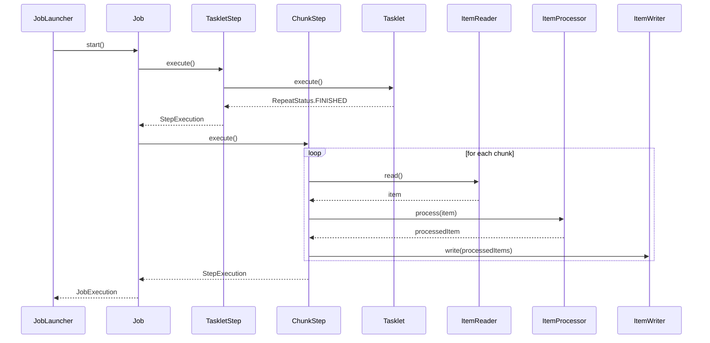

```mermaid
sequenceDiagram
    participant JobLauncher
    participant Job
    participant Step1 as TaskletStep
    participant Step2 as ChunkStep
    participant Tasklet
    participant Reader as ItemReader
    participant Processor as ItemProcessor
    participant Writer as ItemWriter

    JobLauncher->>Job: start()
    Job->>Step1: execute()
    Step1->>Tasklet: execute()
    Tasklet-->>Step1: RepeatStatus.FINISHED
    Step1-->>Job: StepExecution
    Job->>Step2: execute()
    loop for each chunk
        Step2->>Reader: read()
        Reader-->>Step2: item
        Step2->>Processor: process(item)
        Processor-->>Step2: processedItem
        Step2->>Writer: write(processedItems)
    end
    Step2-->>Job: StepExecution
    Job-->>JobLauncher: JobExecution
```