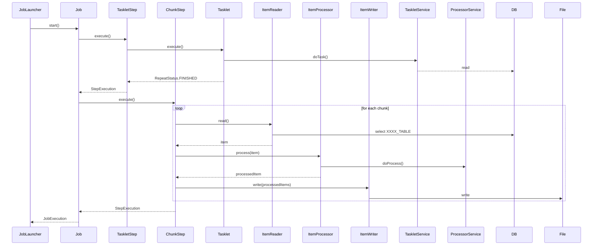

```mermaid
sequenceDiagram
    participant JobLauncher
    participant Job
    participant Step1 as TaskletStep
    participant Step2 as ChunkStep
    participant Tasklet
    participant Reader as ItemReader
    participant Processor as ItemProcessor
    participant Writer as ItemWriter
    participant TaskletService
    participant ProcessorService
    participant DB
    participant File

    JobLauncher->>Job: start()
    Job->>Step1: execute()
    Step1->>Tasklet: execute()
    Tasklet->>TaskletService: doTask()
    TaskletService-->>DB: read
    Tasklet-->>Step1: RepeatStatus.FINISHED
    Step1-->>Job: StepExecution
    Job->>Step2: execute()
    loop for each chunk
        Step2->>Reader: read()
        Reader->>DB: select XXXX_TABLE
        Reader-->>Step2: item
        Step2->>Processor: process(item)
        Processor->>ProcessorService: doProcess()
        Processor-->>Step2: processedItem
        Step2->>Writer: write(processedItems)
        Writer->>File: write
    end
    Step2-->>Job: StepExecution
    Job-->>JobLauncher: JobExecution
```