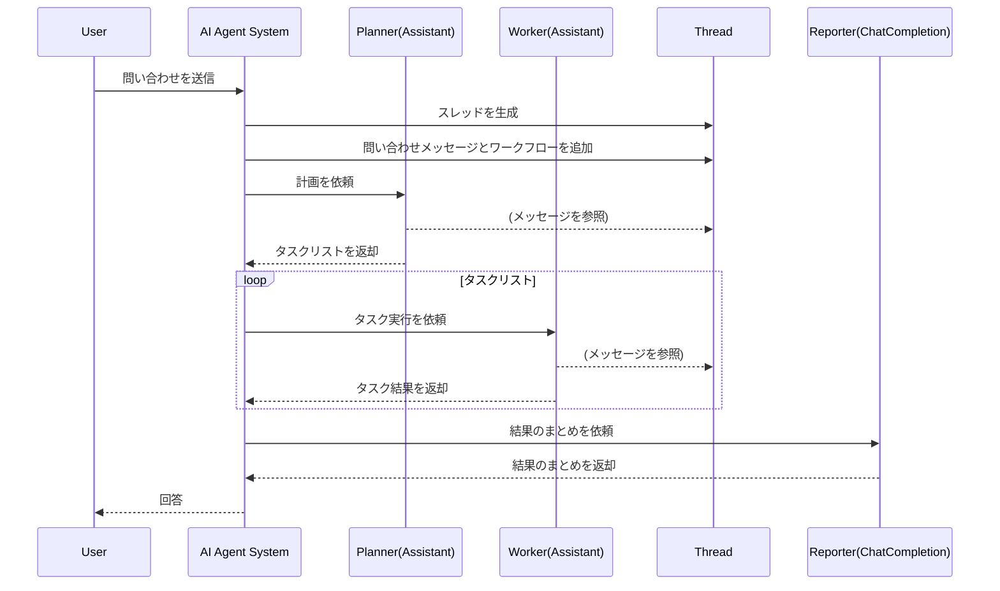
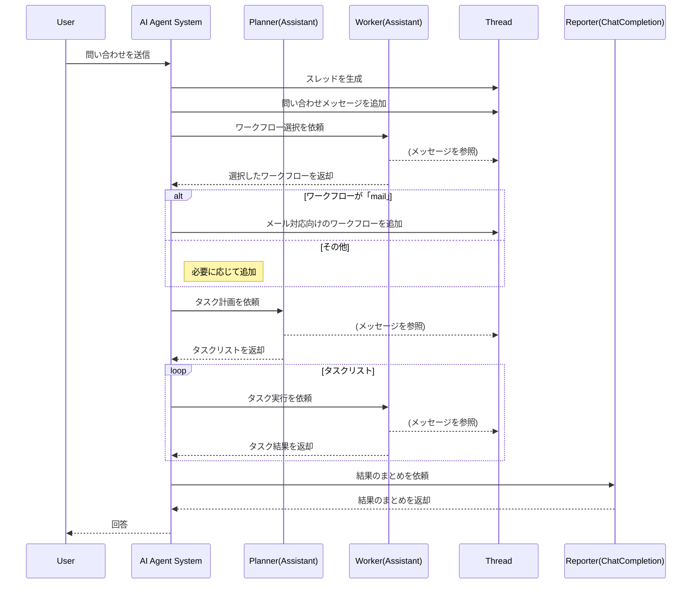

# Ph1

```mermaid
sequenceDiagram
    participant User
    participant System as AI Agent System
    
    participant Planner as Planner(Assistant)
    participant Worker as Worker(Assistant)
    participant Thread
    participant Reporter as Reporter(ChatCompletion)
    

    User ->> System: 問い合わせを送信
    System ->> Thread: スレッドを生成
    System ->> Thread: 問い合わせメッセージとワークフローを追加

    System ->> Planner: 計画を依頼
    Planner -->> Thread : (メッセージを参照)
    Planner -->> System: タスクリストを返却

    loop タスクリスト
        System ->> Worker: タスク実行を依頼
        Worker -->> Thread : (メッセージを参照)
        Worker -->> System: タスク結果を返却
    end

    System ->> Reporter: 結果のまとめを依頼
    Reporter -->> System : 結果のまとめを返却
    System -->> User: 回答
```

# Ph2

```mermaid
sequenceDiagram
    participant User
    participant System as AI Agent System
    participant Planner as Planner(Assistant)
    participant Worker as Worker(Assistant)
    participant Thread
    participant Reporter as Reporter(ChatCompletion)

    User ->> System: 問い合わせを送信
    System ->> Thread: スレッドを生成
    System ->> Thread: 問い合わせメッセージを追加

    System ->> Worker: ワークフロー選択を依頼
    Worker -->> Thread: (メッセージを参照)
    Worker -->> System: 選択したワークフローを返却

    alt ワークフローが「mail」
        System ->> Thread: メール対応向けのワークフローを追加
    else その他
        note right of System: 必要に応じて追加
    end

    System ->> Planner: タスク計画を依頼
    Planner -->> Thread: (メッセージを参照)
    Planner -->> System: タスクリストを返却

    loop タスクリスト
        System ->> Worker: タスク実行を依頼
        Worker -->> Thread: (メッセージを参照)
        Worker -->> System: タスク結果を返却
    end

    System ->> Reporter: 結果のまとめを依頼
    Reporter -->> System: 結果のまとめを返却
    System -->> User: 回答
```