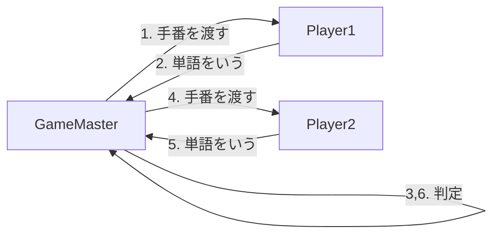

```mermaid
graph LR;
    GameMaster -->|1. 手番を渡す| Player1
    Player1 -->|2. 単語をいう| GameMaster
    GameMaster -->|3,6. 判定| GameMaster
    GameMaster -->|4. 手番を渡す| Player2
    Player2 -->|5. 単語をいう| GameMaster
```